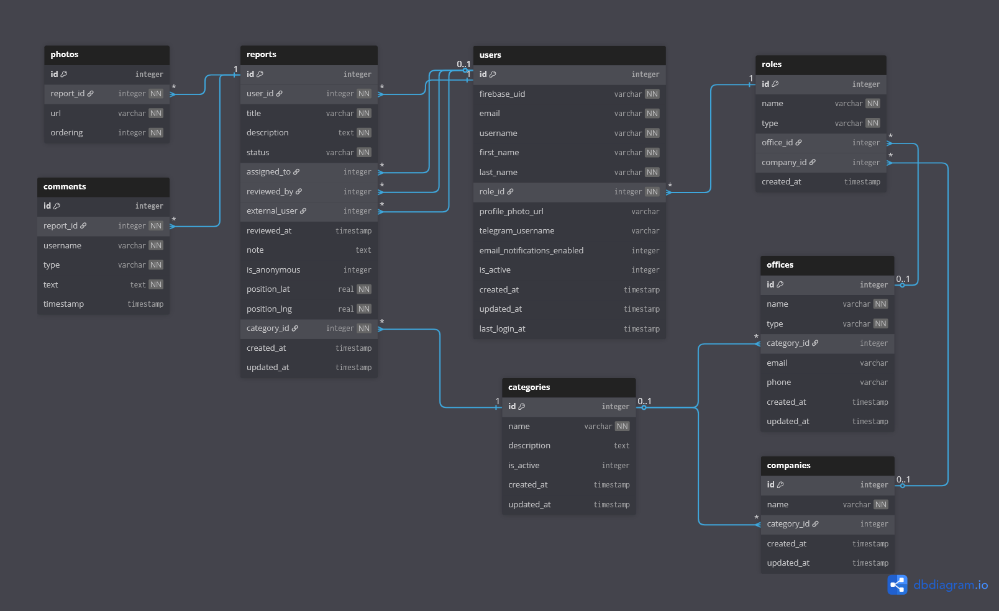

# Database

This directory contains database-related files for the Participium project.

## Files

- `init.ts` - Database initialization logic
- `schema.sql` - Complete database schema definition with all tables, indexes, and triggers

# Database Structure

## Entity Relationship Diagram

## Users Table

The `users` table stores information about users. Each user has exactly one role that determines their permissions and access within the system.

| Column                      | Type                   | Description                                                         |
| --------------------------- | ---------------------- | ------------------------------------------------------------------- |
| id                          | INTEGER PK             | Primary key                                                         |
| firebase_uid                | TEXT                   | Unique Firebase identifier for authentication                       |
| email                       | TEXT                   | Unique email of the user                                            |
| username                    | TEXT                   | Unique username                                                     |
| first_name                  | TEXT                   | User's first name                                                   |
| last_name                   | TEXT                   | User's last name                                                    |
| role_id                     | INTEGER FK → roles(id) | Foreign key linking to the user's role                              |
| profile_photo_url           | TEXT                   | Optional URL for the user's profile picture                         |
| telegram_username           | TEXT                   | Optional Telegram username for notifications                        |
| email_notifications_enabled | INTEGER (boolean)      | Whether the user receives email notifications (1 = true, 0 = false) |
| is_active                   | INTEGER (boolean)      | Whether the user account is active (1 = active, 0 = inactive)       |
| created_at                  | DATETIME               | Timestamp when the user was created                                 |
| updated_at                  | DATETIME               | Timestamp when the user was last updated                            |
| last_login_at               | DATETIME               | Timestamp of the user's last login                                  |
---

## Roles Table

The `roles` table stores predefined user roles for access control. Roles determine which reports a user can view, review, or handle.

| Column     | Type                       | Description                                                                            |
| ---------- | -------------------------- | -------------------------------------------------------------------------------------- |
| id         | INTEGER PK                 | Primary key                                                                            |
| name       | TEXT                       | Role name (`citizen`, `tech_officer`, `pub_relations`, `admin`, `external_maintainer`) |
| type       | TEXT                       | Role type; defines user permissions and workflow responsibilities                      |
| office_id  | INTEGER FK → offices(id)   | Optional foreign key linking the role to an internal office                            |
| company_id | INTEGER FK → companies(id) | Optional foreign key linking the role to an external company                           |
| created_at | DATETIME                   | Timestamp when the role was created                                                    |

**Notes:**
- `citizen` — Regular users who can submit reports  
- `pub_relations` — Municipal Public Relations Officers (approval workflow)  
- `tech_officer` — Technical Office Staff (execution workflow)  
- `external_maintainer` — External company staff  
- `admin` — System administrators  
- Each user has exactly one role, which may reference an office or company.

---

## Offices Table

The `offices` table stores information about internal offices.

| Column      | Type                        | Description                                         |
| ----------- | --------------------------- | --------------------------------------------------- |
| id          | INTEGER PK                  | Primary key                                         |
| name        | TEXT                        | Office name                                         |
| type        | TEXT                        | Office type (`organization`,`technical`)            |
| category_id | INTEGER FK → categories(id) | Each office is responsible for exactly one category |
| email       | TEXT                        | Office contact email                                |
| phone       | TEXT                        | Office contact phone                                |
| created_at  | DATETIME                    | Timestamp when the office was created               |
| updated_at  | DATETIME                    | Timestamp when the office was last updated          |

---

# Categories Table

The `categories` table stores predefined issue categories for reports.

| Column      | Type              | Description                                               |
| ----------- | ----------------- | --------------------------------------------------------- |
| id          | INTEGER PK        | Primary key                                               |
| name        | TEXT              | Category name (e.g., Water Supply, Public Lighting)       |
| description | TEXT              | Optional description of the category                      |
| is_active   | INTEGER (boolean) | Whether the category is active (1 = active, 0 = inactive) |
| created_at  | DATETIME          | Timestamp when the category was created                   |
| updated_at  | DATETIME          | Timestamp when the category was last updated              |

---

# Reports Table

The `reports` table stores user-submitted reports about issues.

| Column       | Type                        | Description                                                                                        |
| ------------ | --------------------------- | -------------------------------------------------------------------------------------------------- |
| id           | INTEGER PK                  | Primary key                                                                                        |
| user_id      | INTEGER FK → users(id)      | The user who created the report                                                                    |
| category_id  | INTEGER FK → categories(id) | Category the report belongs to                                                                     |
| title        | TEXT                        | Title of the report                                                                                |
| description  | TEXT                        | Detailed description of the issue                                                                  |
| status       | TEXT                        | Report status (`pending_approval`, `assigned`, `in_progress`, `suspended`, `rejected`, `resolved`) |
| assigned_to  | INTEGER FK → users(id)      | Technical officer assigned to handle the report (nullable)                                         |
| reviewed_by  | INTEGER FK → users(id)      | Officer who reviewed the report (nullable)                                                         |
| reviewed_at  | DATETIME                    | Timestamp when the report was reviewed                                                             |
| note         | TEXT                        | Optional note; required if the report is rejected                                                  |
| is_anonymous | INTEGER (boolean)           | Whether the report was submitted anonymously (1 = true, 0 = false)                                 |
| position_lat | REAL                        | Latitude of the reported issue                                                                     |
| position_lng | REAL                        | Longitude of the reported issue                                                                    |
| created_at   | DATETIME                    | Timestamp when the report was created                                                              |
| updated_at   | DATETIME                    | Timestamp when the report was last updated                                                         |

---

# Photos Table

The `photos` table stores photos associated with reports.

| Column    | Type                     | Description                 |
| --------- | ------------------------ | --------------------------- |
| id        | INTEGER PK               | Primary key                 |
| report_id | INTEGER FK → reports(id) | Report the photo belongs to |
| url       | TEXT                     | URL of the photo            |
| ordering  | INTEGER                  | Order of the photo (1 to 3) |

---

# Companies Table

The `companies` table stores external maintenance companies that can be assigned to reports.

| Column      | Type                        | Description                                 |
| ----------- | --------------------------- | ------------------------------------------- |
| id          | INTEGER PK                  | Primary key                                 |
| name        | TEXT                        | Company name                                |
| category_id | INTEGER FK → categories(id) | Category the company handles (nullable)     |
| created_at  | DATETIME                    | Timestamp when the company was created      |
| updated_at  | DATETIME                    | Timestamp when the company was last updated |

---

# Comments Table

The `comments` table stores comments on reports, either public or private.

| Column    | Type                     | Description                            |
| --------- | ------------------------ | -------------------------------------- |
| id        | INTEGER PK               | Primary key                            |
| report_id | INTEGER FK → reports(id) | Report the comment belongs to          |
| username  | TEXT                     | Author of the comment                  |
| type      | TEXT                     | Comment type (`public` or `private`)   |
| text      | TEXT                     | Comment content                        |
| timestamp | DATETIME                 | Timestamp when the comment was created |

## Initialization Process

1. **Schema Creation**: The `schema.sql` file is executed to create all tables, indexes, and triggers
2. **Default Data Seeding**:
   - Roles: citizen, org_office_operator, technical_office_operator, admin
   - Categories: 9 predefined categories for issue reporting

## Database Features

### Automatic Timestamps
- `updated_at` fields are automatically updated via triggers
- `created_at` fields use `CURRENT_TIMESTAMP` as default

# Indexes
# Indexes

Optimized for common queries:

- User lookups by email, username, or Firebase UID  
- Filtering active users by `is_active`  
- Role-based queries (users by role)  
- Offices filtered by type and category  
- Active categories filtering  
- Reports filtered by user, status, reviewer, or assigned officer  
- Photos lookup by report  
- Comments lookup by report or type

---

# Foreign Key Constraints

The database enforces referential integrity with specific deletion rules:

| Relationship                              | On Delete | Description                                                        |
| ----------------------------------------- | --------- | ------------------------------------------------------------------ |
| users → roles                             | RESTRICT  | Prevent deleting a role that has active users                      |
| reports → users (creator)                 | RESTRICT  | Prevent deleting a user who has created reports                    |
| reports → users (reviewed_by/assigned_to) | SET NULL  | When a reviewer or assigned officer is deleted, set field to NULL  |
| reports → categories                      | RESTRICT  | Prevent deleting a category that has reports                       |
| photos → reports                          | CASCADE   | When a report is deleted, all associated photos are also deleted   |
| comments → reports                        | CASCADE   | When a report is deleted, all associated comments are also deleted |

---
## Pre-defined Database Promises

Available in `config/database.ts`:
- `getDatabase()` - Get singleton database instance
- `runQuery(sql, params)` - Execute INSERT/UPDATE/DELETE
- `getOne(sql, params)` - Fetch single row
- `getAll(sql, params)` - Fetch multiple rows
- `execSQL(sql)` - Execute raw SQL (for schema)
- `closeDatabase()` - Close database connection

## Notes

- SQLite uses INTEGER for boolean values (1 = true, 0 = false)
- All tables have proper indexes for optimal query performance
- Foreign keys are enabled by default
- The database file location is configured via `DB_PATH` environment variable
